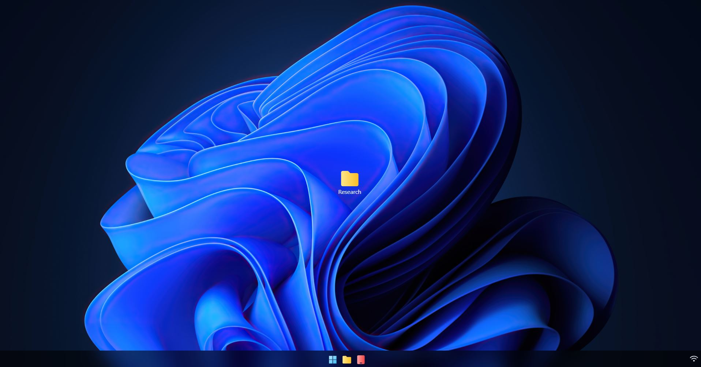

# Pokedesk

## The project

Pokedesk is a fictional desktop session of the Pokémon's Pr Chen. 
It **tries to** imitate a Windows 11 like user interface. 
It contains a little **Pokédex**.

### Technologies

* 🔭 Vue.js (v3.2.36)
* 🍍 Pinia (v2.0.14)
* 🚀 Vite (v2.9.9)
* 🌈 Tailwind CSS (v3.1.4)

*Find more information in the `package.json` file*

### Thoughts

>The project is subject to changes, notably the session's backgrounds, 
and some other UI elements. It's still a work in progress.